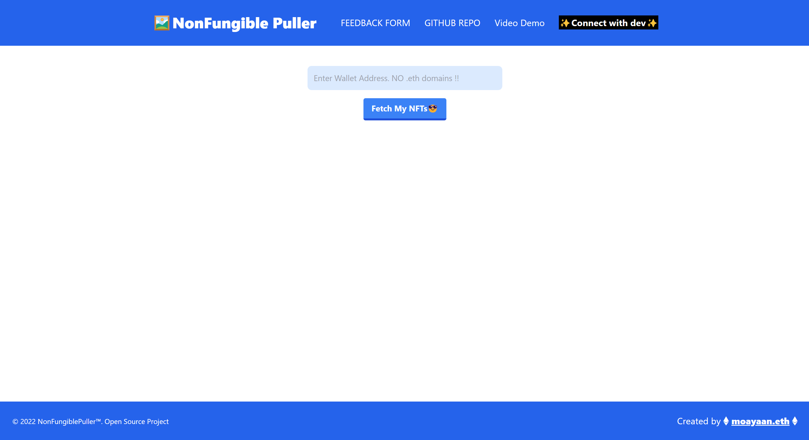
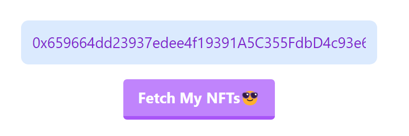
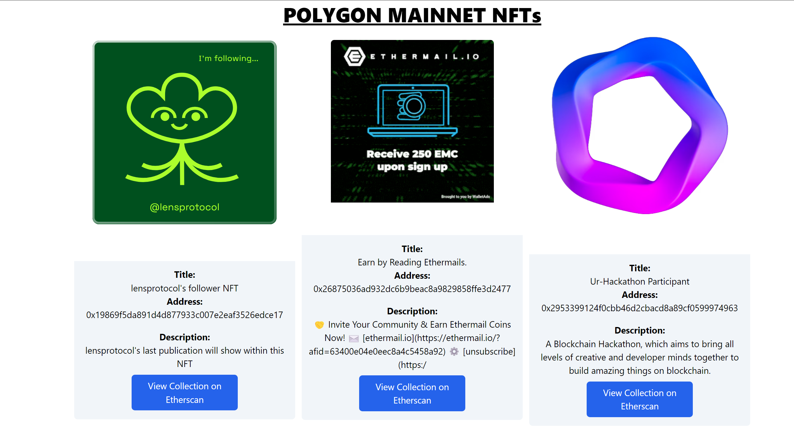
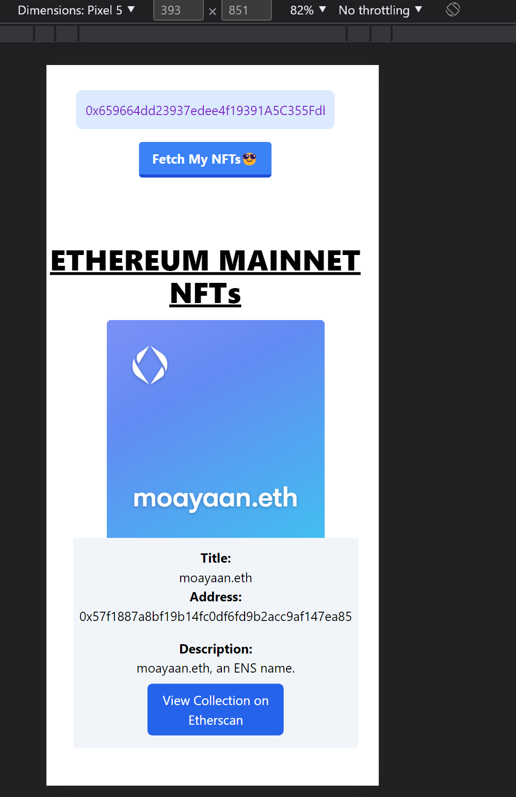

# NonFungible Puller

**Deployment Link:-https://non-fungible-puller.vercel.app/**

---

## PREVIEW

---

## Video DEMO:-

[Video Demo of NonFungible Puller App](https://youtu.be/ed4-9j0uqI0)

---

---

## About the App

NonFungible Puller is a **FREE** and **OPEN SOURCE** NFT Puller web app using which users can see a gallery of their entire NFTs they are holding in their wallets across **MULTIPLE CHAINS!**. The project has been created by **Mohammad Ayaan Siddiqui** and is a PRACTICE project, professional use not advised. The web app comes with **FEEDBACK form** and **GITHUB** source code attached.

---

## TECH STACK

The Tech Stack used in creating this project is:-

1.  [Next.js](https://nextjs.org/)
2.  [Tailwind CSS](https://tailwindcss.com/)
3.  [Alchemy SDK](https://www.alchemy.com/sdk)
4.  [Emojipedia](https://emojipedia.org/)
5.  [Font Awesome](https://fontawesome.com/)

---

## RUN ON LOCAL MACHINE

Steps to run this project on your local machine:-

1. Clone this repo using

`git clone https://github.com/moayaan1911/non-fungible-puller.git`

2. Open the cloned folder

3. Run `yarn` OR `npm i --legacy-peer-deps`

4. Run `yarn dev` OR `npm run dev`

---

## About the Developer

Hello everyone, myself Mohammad Ayaan Siddiqui from India. I am a Full Stack WEB3 developer and a **DECENTRALIZATION MAXI**. I talk about WEB3, Cryptocurrencies, Javascript and Python and currently learning web3. If you are interested in either of the topics, connect with me below:-

1.  [My Linktree with ALL SOCIALS](https://linktr.ee/ayaaneth)

2.  [Connect on Github](https://github.com/moayaan1911)

3.  [Connect on Linkedin](www.linkedin.com/in/ayaaneth)

4.  [Connect on Twitter](https://www.twitter.com/usdisshitcoin)

5.  [Connect on Telegram](https://t.me/usdisshitcoin)

6.  [Connect on dev.to](https://dev.to/moayaan1911)
